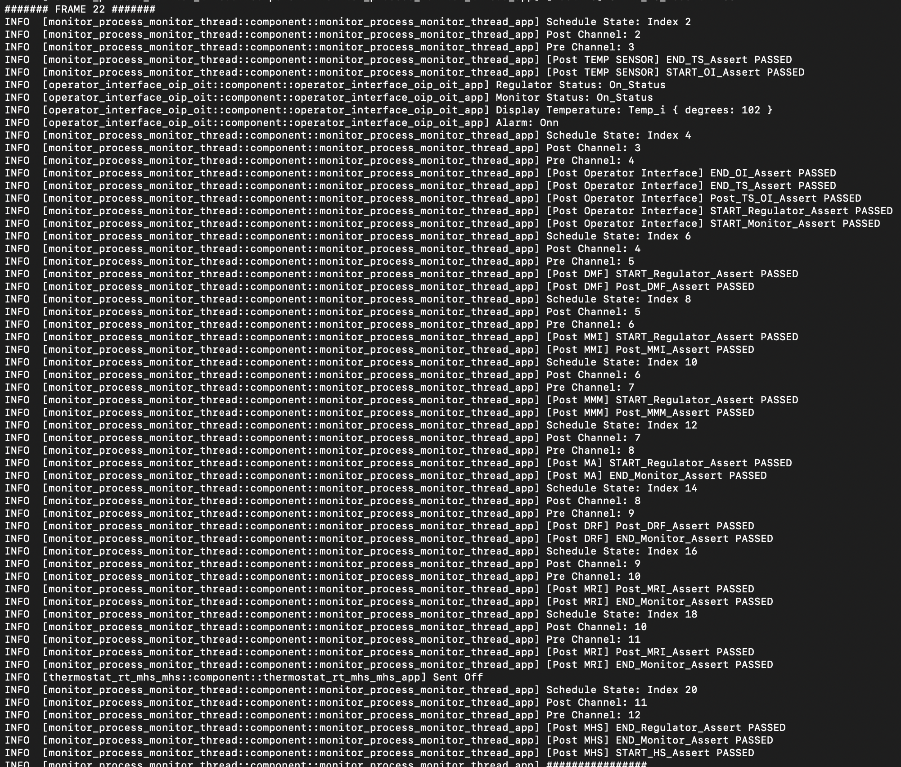

# System Property Walkthrough

This document walks through how a non-trivial system-level property for the Isolette is specified, what conditions are required to verify it, and how it can be checked at runtime.

The work presented here is based on the [HAMRMicro05](https://github.com/santoslab/hamr-system-reasoning-prototype/tree/main/IsabelleFormalization/HAMRMicro05) formalization of the system-level reasoning framework which is outlined in detail in [System Verification for AADL-based Systems](https://hdl.handle.net/2097/47264).

---

# User Perspective

In this section we will go over what the developer would be considering when it comes to a establsihing and proving a system requirement and how they would express these requirements in the form of system contract.

## Example Property

For the purposes of the walkthrough, we will use a property from the [HAMR System Test Case Study](https://github.com/santoslab/hamr-system-testing-case-studies/tree/main/isolette) Isolette example. The property is [sysProp_NormalModeHeatOnn](https://github.com/santoslab/hamr-system-testing-case-studies/blob/main/isolette/hamr/slang/src/test/system/isolette/system_tests/rst/Regulate_Subsystem_Test_wSlangCheck.scala#L537) which states that, for the Regualtor,


> In Normal mode, and in the absence of error-triggering inputs, If current temp is less than lower desired, then heat control shall be ON


This can be formally stated as the following function/predicate.

```scala
def sysProp_NormalModeHeatOnn(regulator_mode: Isolette_Data_Model::Regulator_Mode,
                              current_tempWstatus: Isolette_Data_Model::TempWstatus_i,
                              lower_desired_tempWstatus: Isolette_Data_Model::TempWstatus_i,
                              upper_desired_tempWstatus: Isolette_Data_Model::TempWstatus_i,
                              internal_failure: Isolette_Data_Model::Failure_Flag_i,
                              heat_control: Isolette_Data_Model::On_Off
                            ): Base_Types::Boolean :=
                (lower_desired_tempWstatus.status == Isolette_Data_Model::ValueStatus.Valid
                    and upper_desired_tempWstatus.status == Isolette_Data_Model::ValueStatus.Valid
                    and current_tempWstatus.status == Isolette_Data_Model::ValueStatus.Valid
                    and regulator_mode == Isolette_Data_Model::Regulator_Mode.Normal_Regulator_Mode
                    and current_tempWstatus.degrees < lower_desired_tempWstatus.degrees)
                implies (heat_control == Isolette_Data_Model::On_Off::Onn)
```

This property describes a condition that should hold at some point during the execution of a schedule cycle.

---

## Limitations of the Component Contract

A key observation is that this property cannot be expressed as a single component contract.

Component contracts can only refer to local information:
- the in-coming and out-going channels
- the local state variables

However, the system property above references values distributed across several components and channels. No individual component has access to the complete set of information required to state the property directly.

As a result, system-level reasoning requires:

1. composing guarantees from multiple components,
2. expressing ordering constraints between components,
3. and preserving intermediate properties across execution.

---

## Composing  Component Contracts

Although the full property cannot be stated as a component contract, pieces of it appear across several component contracts.

For example, the Manage Heat Source (MHS) component contains the following requirement.

```
case REQ_MHS_2 "If the Regulator Mode is NORMAL and the Current Temperature is less than
                |the Lower Desired Temperature, the Heat Control shall be set to On.
                |https://www.faa.gov/sites/faa.gov/files/aircraft/air_cert/design_approvals/air_software/AR-08-32.pdf#page=110 ":
    assume (regulator_mode == Isolette_Data_Model::Regulator_Mode.Normal_Regulator_Mode)
        & (current_tempWstatus.degrees < lower_desired_temp.degrees);
    guarantee heat_control == Isolette_Data_Model::On_Off.Onn;
```

This requirement is very close to the desired system property.

However, it refers to:

```scala
lower_desired_temp.degrees
```

while the system property refers to:

```scala
lower_desired_tempWstatus.degrees
```

Therefore, additional reasoning is needed to establish that these values are equivalent.

This equivalence is established by the Manage Regulator Interface (MRI) component.

```
case REQ_MRI_8 "If the Regulator Interface Failure is False,
                |the Desired Range shall be set to the Desired Temperature Range.
                |https://www.faa.gov/sites/faa.gov/files/aircraft/air_cert/design_approvals/air_software/AR-08-32.pdf#page=108 ":
    guarantee 
        '->:' (not interface_failure.flag,
                (lower_desired_temp.degrees == lower_desired_tempWstatus.degrees) & (upper_desired_temp.degrees == upper_desired_tempWstatus.degrees));
                    
```

and

```
case REQ_MRI_7 "If the Status attribute of the Lower Desired Temperature
                |and the Upper Desired Temperature is Valid,
                |the Regulator Interface Failure shall be set to False.
                |https://www.faa.gov/sites/faa.gov/files/aircraft/air_cert/design_approvals/air_software/AR-08-32.pdf#page=108 ":
    guarantee (interface_failure.flag == (not((upper_desired_tempWstatus.status == Isolette_Data_Model::ValueStatus.Valid) & (lower_desired_tempWstatus.status == Isolette_Data_Model::ValueStatus.Valid))));         
```

Together these imply:

- in the absence of error-triggering inputs there is no interface failure for the regualtor,
- and no interface failure implies equality between the desired temperature values.

This creates a dependency chain:

1. MRI establishes the desired temperature relationships
2. MHS depends on those relationships

Therefore MRI must execute before MHS

<!--
#This property established that, because the requirement assumes the inputs to the regualtor are valid, there is no interface failure and therefore ```lower_desired_tempWstatus.degrees``` equals ```lower_desired_temp.degrees```.

By looking at these requirements we can see that, within a schedule cycle, MRI has to run before MHS so it can be guaranteed that the ```REQ_MRI_7``` and ```REQ_MRI_8``` hold before the execution of MHS. 

Now it is important to note that this not saying that MRI must be scheduled directly before MHS. It simply requires that MRI must be schedule before MHS. Now, because other components may execute between the MRI and MHS, there needs to be a method to ensure that ```REQ_MRI_7``` and ```REQ_MRI_8``` are preserved over the execution of another component. For this, we introduce the idea of a component write frame to the system. A component write frame is a predicate that is generated from the structure of the model for the system which describes what about the system state (i.e., the channel state and the component states) does not update as a result of executing a component. These can be used to guarantee that the execution of a component does not interfere with some requirement. A write frame would look something like

```
old(channel_1) = channel_1
...
^ old(channel_n) = channel_n
^ old(state_variable_1) = state_variable_1
...
^ old(state_variable_m) = state_variable_m
```

As an example for the Isolette, we may choose to require that MRM execute after MRI but before MHS. We would then require that the write frame of MRM be strong enough to prove that ```REQ_MRI_7``` and ```REQ_MRI_8``` are preserved over the execution of the MRM. In fact it is which can see from a snippet of the MRM write frame.

```
...
^ old(lower_desired_tempWstatus) == lower_desired_tempWstatus
^ old(upper_desired_tempWstatus) == upper_desired_tempWstatus
^ old(lower_desired_temp) == lower_desired_temp
^ old(upper_desired_temp) == upper_desired_temp
^ old(interface_failure) == interface_failure
^ old(regulator_mode) == regulator_mode
...
```


This predicate guarantees that the MRM does not modify any channel or component state variable associated with ```REQ_MRI_7``` and ```REQ_MRI_8```. 
-->

---

## Write Frames and Preservation

The framework does not require MRI to execute immediately before MHS. Other components may be required to execute between them. Therefore, we must ensure that the properties established by MRI (i.e., ```REQ_MRI_7``` and ```REQ_MRI_8```) are preserved until MHS executes. This is handled using component write frames. 

A write frame is a predicate automatically generated from the system model that specifies which parts of the system state a component does **not** modify.

A component write frame looks like:

```text
old(channel_1) = channel_1
...
old(channel_n) = channel_n

old(state_variable_1) = state_variable_1
...
old(state_variable_m) = state_variable_m
```

Suppose the Manage Regulator Mode (MRM) component executes between MRI and MHS. The write frame for MRM must guarantee that it does not modify the values refered to by ```REQ_MRI_7``` and ```REQ_MRI_8```.

Therefore, the frame condition of the MRM must contain the following predicate to ensure it does not modify the channels associated with ```REQ_MRI_7``` and ```REQ_MRI_8```:

```text
old(lower_desired_tempWstatus) == lower_desired_tempWstatus
old(upper_desired_tempWstatus) == upper_desired_tempWstatus
old(lower_desired_temp) == lower_desired_temp
old(upper_desired_temp) == upper_desired_temp
old(interface_failure) == interface_failure
old(regulator_mode) == regulator_mode
```

This write frame snippet allow the framework to prove that the ```REQ_MRI_7``` and ```REQ_MRI_8``` remain true after MRM executes given they hold before it.

---

## System Assertions

To reason about properties that hold at different points in a schedule, the framework introduces system assertions. A system assertion is a predicate that should hold between the execution of two distinct explicitly constrained sets of components in a schedule (e.g., after some set of components executes but before another set begins to execute). 

This means we want to associate assertions with some ordering constraint.

The framework defines three major categories of assertions, where an individual assertion may fall into more than one category.

### 1. Assertions Derived from Component Postconditions

These assertions lift component guarantees to the system level.

```
SysAssert {
    Name: Post_MRI_Assert,
    Assert:
        // derived from component contract
            sysProp_REQ_MRI_7
            and sysProp_REQ_MRI_8
}
```

This states that the MRI guarantees `sysProp_REQ_MRI_7` and `sysProp_REQ_MRI_8` should hold after MRI executes.

### 2. Carry Assertions

Carry assertions preserve previously established facts across additional component executions.

For example:

```
SysAssert {
    Name: Post_MRM_Assert,
    Assert:
        //holds from frame condition
        sysProp_REQ_MRI_7
        and sysProp_REQ_MRI_8
}
```

This assertion states that the MRI properties that held after MRI executes continue to hold after MRM executes. These assertions are typically proven using frame conditions.

### 3. Complex Behavior Assertions

These assertions express higher-level system behavior (i.e., end-to-end properties).

For this walkthrough, the following is an example:

```
SysAssert {
    Name: END_Regulator_Assert,
    Assert: 
        sysProp_NormalModeHeatOnn                
}
```

This is an end-to-end property of the regualtor, and it is not simply copied from a component contract.

Instead, it emerges from:

- component contracts,
- scheduling constraints,
- preserved assertions,
- and system-level reasoning


<!--
To formalize the idea of capturing that requirements should hold at some point in the schedule, we introduce system assertions which are predicates that should remain true between the execution of two set of components that are not neccesarily consecutive. There are three types of assertions that are used being

1. Assertions that raise a postcondition to the system level
2. Assertions that "carry" assertions to future points in the schedule
3. Assertions that enfore some complex behavior

An example of the first type is would be restating the requirements ```REQ_MRI_7``` and ```REQ_MRI_8``` as system properties that should hold after the execution of the MRI. This may be stated as the following system assertion.

```
SysAssert {
    Name: Post_MRI_Assert,
    Assert:
        // derived from component contract
            sysProp_REQ_MRI_7(lower_desired_tempWstatus,  upper_desired_tempWstatus, interface_failure)
            and sysProp_REQ_MRI_8(lower_desired_tempWstatus, upper_desired_tempWstatus, lower_desired_temp, upper_desired_temp, interface_failure)
}
```

where ```sysProp_REQ_MRI_7``` and ```sysProp_REQ_MRI_8``` are the following functions derived from the above requirements

```
def sysProp_REQ_MRI_7( lower_desired_tempWstatus: Isolette_Data_Model::TempWstatus_i,
                    upper_desired_tempWstatus: Isolette_Data_Model::TempWstatus_i,
                    interface_failure: Isolette_Data_Model::Failure_Flag_i
                    ): Base_Types::Boolean :=
    (interface_failure.flag == (not((upper_desired_tempWstatus.status == Isolette_Data_Model::ValueStatus.Valid) 
                                and (lower_desired_tempWstatus.status == Isolette_Data_Model::ValueStatus.Valid))))

def sysProp_REQ_MRI_8( lower_desired_tempWstatus: Isolette_Data_Model::TempWstatus_i,
                    upper_desired_tempWstatus: Isolette_Data_Model::TempWstatus_i,
                    lower_desired_temp: Isolette_Data_Model::Temp_i,
                    upper_desired_temp: Isolette_Data_Model::Temp_i,
                    interface_failure: Isolette_Data_Model::Failure_Flag_i
                    ): Base_Types::Boolean :=
            (not interface_failure.flag)
            imples (lower_desired_temp.degrees == lower_desired_tempWstatus.degrees 
                    and upper_desired_temp.degrees == upper_desired_tempWstatus.degrees)
```

An example of the second type would be that we may execute the manage regulator mode (MRM) after the MRI but before we execute the MHS, but as stated before, ```sysProp_REQ_MRI_7``` and ```sysProp_REQ_MRI_8``` need to hold before the execution of MHS to prove ```sysProp_NormalModeHeatOnn```. To accomplish this, we can state that ```sysProp_REQ_MRI_7``` and ```sysProp_REQ_MRI_8``` should hold after the execution of MRM. This may stated as the following system assertion.

```
SysAssert {
    Name: Post_MRM_Assert,
    Assert:
        //holds from frame condition
        sysProp_REQ_MRI_7(lower_desired_tempWstatus,  upper_desired_tempWstatus, interface_failure)
        and sysProp_REQ_MRI_8(lower_desired_tempWstatus, upper_desired_tempWstatus, lower_desired_temp, upper_desired_temp, interface_failure)
}
```

An example of the third type would be the property we are focusing on for this walkthrough being ```sysProp_NormalModeHeatOnn```. This assertion does not restate a previous assertion and it is not something that can be derived directly from the postconditions of any component. This property is expressing the complex behavior of an end-to-end requirement of the regualotor which requires considering the behavior of several components. This may stated as the following system assertion.

```
SysAssert {
    Name: END_Regulator_Assert,
    Assert: 
        sysProp_NormalModeHeatOnn(regulator_mode, currentTempWStatus, lowerDesiredTempWStatus, upperDesiredTempWStatus, internalFailure, heat_control)                   
}
```
-->

---

## Schedule Schemas and System Contracts

The framework represents the scheduling constraints and the system contracts related to them using schedule schemas. 

A schedule schema is a development artifact created druing the modeling phase that describes:

- which components must execute before others,
- which groups of components may execute independently,
- and what system assertions should hold throughout execution.

---

## Example Scheduling Constraints

As an example, for the Isolette system we may require:

- Operator Interface executes before Regulator
- Operator Interface executes before Monitor
- Temperature Sensor executes before Regulator
- Temperature Sensor executes before Monitor
- Regulator executes before Heat Source
- Monitor executes before Heat Source

Within the Regulator subsystem:

1. DRF
2. MRI
3. MRM
4. MHS

must execute in this order.

Within the Monitor subsystem:

1. DMF
2. MMI
3. MMM
4. MA

must execute in this order.

---

## Proposed Schedule Schema and Contract for the Isolette

The following is the schedule schema for the Isolette that expresses
- Above-mentioned scheduling constraints
- and the assertions needed to prove `sysProp_NormalModeHeatOnn` holds after MHS (This section is marked in the schema below)

```
Contract {
	SysAssert {
        Name: START_Assert,
        Assert: True
    },
    SplitJoin {
        Schema { // OI
            SysAssert {
                Name: START_OI_Assert,
                Assert: True
            },
            Component { //assumptions proven
                Name: oi
            },
            SysAssert {
                Name: END_OI_Assert,
                Assert: True
            }
        },
        Schema { // TS
            SysAssert {
                Name: START_TS_Assert,
                Assert: True
            },
            Component { //assumptions proven
                Name: ts
            },
            SysAssert {
                Name: END_TS_Assert,
                Assert: True
            }
        }
    },
    SysAssert {
        Name: Post_TS_OI_Assert,
        Assert: True
    },
    SplitJoin {
        Schema { // Regulator
            SysAssert {
                Name: START_Regulator_Assert,
                Assert: true
            },
            Component { //assumptions proven
                Name: drf
            },
            SysAssert {
                Name: Post_DRF_Assert,
                Assert: 
                    //holds from frame condition
                    true
            },

            +------------------------------------------+
            |----------- THE IMPORTANT PART -----------|
            +------------------------------------------+

            Component { //assumptions proven
                Name: mri
            },
            SysAssert {
                Name: Post_MRI_Assert,
                Assert:
                    // derived from component contract
                        sysProp_REQ_MRI_7
                        and sysProp_REQ_MRI_8
                        and sysProp_lower_is_lower_temp
            },
            Component { //assumptions proven
                Name: mrm
            },
            SysAssert {
                Name: Post_MRM_Assert,
                Assert:
                    //holds from frame condition
                    sysProp_REQ_MRI_7
                    and sysProp_REQ_MRI_8
                    and sysProp_lower_is_lower_temp
            },
            Component { //assumptions proven
                Name: mhs
            },
            SysAssert { //look at REQ_MHS_2
                Name: END_Regulator_Assert,
                Assert: 
                    sysProp_NormalModeHeatOnn               
            }

            +-----------------------------------------------+
            |---------- END OF THE IMPORTANT PART ----------|
            +-----------------------------------------------+
        },
        Schema { //Monitor
            SysAssert {
                Name: START_Monitor_Assert,
                Assert: True
            },
            Component { //assumptions proven
                Name: dmf
            },
            SysAssert {
                Name: Post_DMF_Assert,
                Assert: True
            },
            Component { //assumptions proven
                Name: mmi
            },
            SysAssert {
                Name: Post_MMI_Assert,
                Assert: True
            },
            Component { //assumptions proven
                Name: mmm
            },
            SysAssert { 
                Name: Post_MMM_Assert,
                Assert: True
            },
            Component { //assumptions proven
                Name: ma
            },
            SysAssert { //look at REQ_MA_2
                Name: END_Monitor_Assert,
                Assert: True
            }
        }
    }
    SysAssert { // HS
        Name: START_HS_Assert,
        Assert: True
    },
    Component { //assumptions proven
        Name: hs
    },
    SysAssert {
        Name: END_Assert,
        Assert: True
    }
}
```

<u>NOTE:</u> This contract only presents the necessary assertion to prove that `sysProp_NormalModeHeatOnn` and is missing some crucial details necessary to prove other system-level requirements and component preconditions along with the function representation of certain requirements. The full contract and all functional representation of the requirements can be found [here](https://github.com/santoslab/hamr-system-reasoning-prototype/blob/main/IsoletteExample/Aritfacts/TextualContract.txt).

---

## Understanding the Schema Structure

This schedule schema contains five primary constructs.

### 1. Component

```text
Component {
  Name: component name
}
```

Represents a component of the system.

---

### 2. SysAssert

```text
SysAssert {
  Name: assert name
  Assert: some predicate
}
```

Represent a system assertion which can express:

1. A property that should hold between two explicitly constrained components
    ```
    Post_MRM_Assert holds after MRM executes but before MHS executes
    ```

    **<u>NOTE:</u>** We refer to this assertion as a **pre-assertion** of MHS and a **post-assertion** of MRM because MRM and MHS directly define the interval within the schedule over which the assertion holds. This terminology will be used throughout the remainder of the walkthrough.

2. A property that holds between two sets of explicitly constrained components
    ```
    Post_TS_OI_Assert holds after both TS and OI have executed but before either DRF and DMF have
    ```

3. A property that holds at the start or end of Schema/Cycle
    ```
    . START_Assert holds before any component has executed in a schedule cycle
    . END_Regulator_Assert holds after the regulator subsystem has finished execution
    ```

---

### 3. Schema

```text
Schema {
  SysAssert {
    Name: ...
    Assert: ...
  },
  ...,
  SysAssert {
    Name: ...
    Assert: ...
  }
}
```

Represents an ordered sequence of components and SplitJoin structures.

Components associated with each element have a higher scheduling priority than those in subsequent element.

---

### 4. SplitJoin

```text
SplitJoin {
  Schema {...},
  Schema {...},
  ...,
  Schema {...}
}
```

A SplitJoin represents a collection of Schema branches that each have their own local ordering constraints and associated assertions, but no ordering constraints relative to one another.

In other words:

- components within a single Schema must respect that schema’s ordering,
- but components from different schemas may be interleaved arbitrarily.

This structure is used to represent portions of the system where there are no scheduling constraints between groups of components, even though each group may internally require a specific execution order.

The SplitJoin construct is important because it can be used to separate:

- subsystem reasoning,
- from whole-system interleaving reasoning.

This allows the framework to reason about each subsystem independently using only the scheduling constraints and their associated assertions relevant to that subsystem.

For example, consider the Regulator and Monitor subsystems. The correctness proof for the Regulator subsystem should not depend on how Monitor components are interleaved with Regulator components at the system level.

As long as the local ordering constraints of each subsystem are preserved, schedules such as:

```
DMF -> MMI -> MMM -> MA -> DRF -> MRI -> MRM -> MHS
```

and

```
DMF -> DRF -> MMI -> MRI -> MRM -> MMM -> MHS -> MA
```

should both preserve the correctness of the Regulator subsystem.

The SplitJoin structure enables this style of compositional reasoning by allowing the framework to:

- prove properties locally within a subsystem (Schema),
- then compose those proofs globally while permitting valid interleavings (SplitJoin).

This significantly reduces proof complexity because:

1. the framework does not need to reason about every possible system-wide interleaving, and
2. subsystem correctness proofs can be developed independently of unrelated subsystem scheduling behavior.

---

### 5. Contract

The Contract is the entire schedule schema which contains:

- the complete scheduling structure,
- all system assertions,
- and the ordering constraints required for verification.

<!--
Now that the idea of system assertions have been expressed, we now need a way of expressing the scheduling constraints of the system to express that certain sets of components must come before others as the ordering of components is important for system-level reasoning. To do this, we introduce the concept of a schedule schema which is a textual representation of the constraints and the assertions associated with each constraint which is produced by a developer during the modeling phase to express the system requirements. 

For this walkthrough we will consider the following constraints for Isolette

```
- The **Operator Interface** must be scheduled before the **Regulator**
- The **Operator Interface** must be scheduled before the **Monitor**
- The **Temp Sensor** must be scheduled before the **Regulator**
- The **Temp Sensor** must be scheduled before the **Monitor**
- The **Regulator** must be scheduled before the **Heat Source**
- The **Monitor** must be scheduled before the **Heat Source**

The components of the Regulator must be scheduled in the following order
1. Detect Regulator Failure (DRF)
2. Manage Regulator Interface (MRI)
3. Manage Regulator Mode (MRM)
4. Manage Heat Source (MHS)

The components of the Monitor must be scheduled in the following order
1. Detect Monitor Failure (DMF)
2. Manage Monitor Interface (MMI)
3. Manage Monitor Mode (MMM)
4. Manage Alarm (MA)
```

Given these requirements we would create the following schedule schema.

```
Contract {
	SysAssert {
        Name: START_Assert,
        Assert: True
    },
    SplitJoin {
        Schema { // OI
            Component { //assumptions proven
                Name: oi
            },
        },
        Schema { // TS
            Component { //assumptions proven
                Name: ts
            },
        }
    },
    SplitJoin {
        Schema { // Regulator
            Component { //assumptions proven
                Name: drf
            },
            Component { //assumptions proven
                Name: mri
            },
            Component { //assumptions proven
                Name: mrm
            },
            Component { //assumptions proven
                Name: mhs
            }
        },
        Schema { //Monitor
            Component { //assumptions proven
                Name: dmf
            },
            Component { //assumptions proven
                Name: mmi
            },
            Component { //assumptions proven
                Name: mmm
            },
            Component { //assumptions proven
                Name: ma
            }
        }
    }
    Component { //assumptions proven
        Name: hs
    },
}
```

By looking at this schema we can see several elements.

```Component```: This represents a component of the system

```Schema```: This represents an ordered series of components and SplitJoins, where the components associated with each have a higher priority than those in subsequent element

```Contract```: This is a Schema that encompasses the entire schedule schema

```SplitJoin```: A SplitJoin is a structure that has several Schemas such that every element in one schema has no scheduling constraints with any component in any other schema. This means that ordering does not matter where the Schemas can be interleaved within the schedule given the constraints expressed by each schema are respected.

We can now augment the schedule schema with system assertions that should hold at the at different points in the execution of the system. To express the ```sysProp_NormalModeHeatOnn``` and the assertions needed to prove the requirement, the schedule schema for the Isolette would be augmented as such.

```
Contract {
	SysAssert {
        Name: START_Assert,
        Assert: True
    },
    SplitJoin {
        Schema { // OI
            SysAssert {
                Name: START_OI_Assert,
                Assert: True
            },
            Component { //assumptions proven
                Name: oi
            },
            SysAssert {
                Name: END_OI_Assert,
                Assert: True
            }
        },
        Schema { // TS
            SysAssert {
                Name: START_TS_Assert,
                Assert: True
            },
            Component { //assumptions proven
                Name: ts
            },
            SysAssert {
                Name: END_TS_Assert,
                Assert: True
            }
        }
    },
    SysAssert {
        Name: Post_TS_OI_Assert,
        Assert: True
    },
    SplitJoin {
        Schema { // Regulator
            SysAssert {
                Name: START_Regulator_Assert,
                Assert: true
            },
            Component { //assumptions proven
                Name: drf
            },
            SysAssert {
                Name: Post_DRF_Assert,
                Assert: 
                    //holds from frame condition
                    true
            },
            Component { //assumptions proven
                Name: mri
            },
            SysAssert {
                Name: Post_MRI_Assert,
                Assert:
                    // derived from component contract
                        sysProp_REQ_MRI_7(lower_desired_tempWstatus,  upper_desired_tempWstatus, interface_failure)
                        and sysProp_REQ_MRI_8(lower_desired_tempWstatus, upper_desired_tempWstatus, lower_desired_temp, upper_desired_temp, interface_failure)
            },
            Component { //assumptions proven
                Name: mrm
            },
            SysAssert {
                Name: Post_MRM_Assert,
                Assert:
                    //holds from frame condition
                    sysProp_REQ_MRI_7(lower_desired_tempWstatus,  upper_desired_tempWstatus, interface_failure)
                    and sysProp_REQ_MRI_8(lower_desired_tempWstatus, upper_desired_tempWstatus, lower_desired_temp, upper_desired_temp, interface_failure)
                    and sysProp_lower_is_lower_temp(lower_desired_temp, upper_desired_temp)
            },
            Component { //assumptions proven
                Name: mhs
            },
            SysAssert { //look at REQ_MHS_2
                Name: END_Regulator_Assert,
                Assert: 
                    sysProp_NormalModeHeatOnn(regulator_mode, currentTempWStatus, lowerDesiredTempWStatus, upperDesiredTempWStatus, internalFailure, heat_control)                   
            }
        },
        Schema { //Monitor
            SysAssert {
                Name: START_Monitor_Assert,
                Assert: True
            },
            Component { //assumptions proven
                Name: dmf
            },
            SysAssert {
                Name: Post_DMF_Assert,
                Assert: True
            },
            Component { //assumptions proven
                Name: mmi
            },
            SysAssert {
                Name: Post_MMI_Assert,
                Assert: True
            },
            Component { //assumptions proven
                Name: mmm
            },
            SysAssert { 
                Name: Post_MMM_Assert,
                Assert: True
            },
            Component { //assumptions proven
                Name: ma
            },
            SysAssert { //look at REQ_MA_2
                Name: END_Monitor_Assert,
                Assert: True
            }
        }
    }
    SysAssert { // HS
        Name: START_HS_Assert,
        Assert: True
    },
    Component { //assumptions proven
        Name: hs
    },
    SysAssert {
        Name: END_Assert,
        Assert: True
    }
}
```


As before, adding the system assertion introduces a new element ```SysAssert``` which expresses: 

A property that should hold between two components
```
Post_MRM_Assert holds after MRM executes but before MHS executes
```

A property that holds between the sets of two components
```
Post_TS_OI_Assert holds after both TS and OI have executed but before either DRF and DMF
```

A property that holds at the start and end of Schema/Contract
```
. START_Assert holds before any component has executed in a schedule cycle
. END_Regulator_Assert holds after the regulator subsystem has finished execution
```

* Express we have some set of constraints DONE
    * Our neccesary sequence of components is a sequence of constraints DONE
* Present the schema and contract DONE
    * Explain what things do like split join DONE
    * Explain how this seperates our reasoning of subsystems such that we don't care about interleaving (explain the syntatic constraint of independence) TODO
    * Explain how this seperates our need to reason about a subsystem away from the system as a whole TODO
* Trace our needed assertions over the contract until the property is achieved TODO

-->

---

## Tracing the Property Through the Schedule Schema

By looking at the schedule schema for the Isolette along with the provided assertions, we can see how `sysProp_NormalModeHeatOnn` is considered and proven in the context of this framework within the marked section.

```
+------------------------------------------+
|----------- THE IMPORTANT PART -----------|
+------------------------------------------+

Component { //assumptions proven
    Name: mri
},
SysAssert {
    Name: Post_MRI_Assert,
    Assert:
        // derived from component contract
            sysProp_REQ_MRI_7
            and sysProp_REQ_MRI_8
            and sysProp_lower_is_lower_temp
},
Component { //assumptions proven
    Name: mrm
},
SysAssert {
    Name: Post_MRM_Assert,
    Assert:
        //holds from frame condition
        sysProp_REQ_MRI_7
        and sysProp_REQ_MRI_8
        and sysProp_lower_is_lower_temp
},
Component { //assumptions proven
    Name: mhs
},
SysAssert { //look at REQ_MHS_2
    Name: END_Regulator_Assert,
    Assert: 
        sysProp_NormalModeHeatOnn               
}

+-----------------------------------------------+
|---------- END OF THE IMPORTANT PART ----------|
+-----------------------------------------------+
```

The overall proof strategy for `sysProp_NormalModeHeatOnn` proceeds as follows.

### Step 1: MRI establishes required relationships

```
Component {
    Name: mri
},
SysAssert {
    Name: Post_MRI_Assert,
    Assert:
        // derived from component contract
            sysProp_REQ_MRI_7
            and sysProp_REQ_MRI_8
            and sysProp_lower_is_lower_temp
},
```

MRI establishes:

- valid inputs imply no interface failure,
- and no interface failure implies equality between desired temperature values.
- and lower desired temp is less than or equal to upper desired temp

These become `Post_MRI_Assert`.

---

### Step 2: MRM preserves the MRI properties

```
Component {
    Name: mri
},
SysAssert {
    Name: Post_MRI_Assert,
    Assert:
        // derived from component contract
            sysProp_REQ_MRI_7
            and sysProp_REQ_MRI_8
            and sysProp_lower_is_lower_temp
},
Component {
    Name: mrm
},
SysAssert {
    Name: Post_MRM_Assert,
    Assert:
        //holds from frame condition
        sysProp_REQ_MRI_7
        and sysProp_REQ_MRI_8
        and sysProp_lower_is_lower_temp
},
```

MRM executes after MRI.

The MRM write frame proves that it does not modify the variables referenced by the MRI assertions.

Therefore, `Post_MRM_Assert` holds

---

### Step 3: MHS uses the preserved properties

`Post_MRM_Assert` implies the precondition of MHS (i.e., [lower_is_lower_temp](https://github.com/santoslab/hamr-system-reasoning-prototype/blob/2d5a999b69915d74aede2239dec4bcf462cada09/IsoletteExample/855-s26-isolette-project/isolette/sysml/Regulate.sysml#L186)).

This allows the framework to use the MHS contract instead of reasoning directly about implementation.

---

### Step 4: The end-to-end property is established

Using the MHS postcondition together with the preserved MRI assertions, the framework proves:

```text
END_Regulator_Assert
```

which contains:

```text
sysProp_NormalModeHeatOnn(...)
```

Thus the system-level property is established at the end of the Regulator subsystem execution.

---

# Framework Perspective

This section describes how the framework processes a system contract.

The framework performs two major tasks:

1. static verification using verification conditions,
2. runtime monitoring during execution.

## Verification Conditions

Verification conditions (VCs) are the minimal logical obligations required to prove that the system satisfies its contract.

These VCs are discharged automatically using SMT-based tooling.

The framework generates several classes of VCs.

**<u>NOTE:</u>** The full list of generated VCs for the Isolette example can be found [here](https://github.com/santoslab/hamr-system-reasoning-prototype/blob/main/IsoletteExample/Aritfacts/VCs.md).

---
## Init-State VC

### Definition

The initial state must satisfy the assertions that hold at the start of the schedule cycle.

### Purpose

This proves that compute phase begins in a valid state.

### Example

```
st satisfies all initialize guarantees
⊢ START_Assert st
```

This expands to

```
// OI
I_Guar_lower_alarm_tempWstatus(lower_alarm_tempWstatus)
^ I_Guar_upper_alarm_tempWstatus(upper_alarm_tempWstatus)
// MRI
^ initialize_RegulatorStatusIsInitiallyInit(regulator_status)
// MRM
^ initialize_REQ_MRM_1(api_regulator_mode)
// MHS
^ initialize_initlastCmd(lastCmd) &&
^ initialize_REQ_MHS_1(heat_control)
// MMI
^ initialize_monitorStatusInitiallyInit(monitor_status)
// MMM
^ initialize_REQ_MMM_1(monitor_mode)
// MA
^ initialize_REQ_MA_1(lastCmd, alarm_control)
⊢ True
```

---

## Pre-Assert VC

### Definition

The pre-assertions of a component must imply the component precondition.

### Purpose

This allows the framework to use the component contract instead of reasoning or re-reasoning about implementation.

### Example

```
Post_MRM_Assert st
⊢ st satisfies MHS's Precondition
```

This expands to

```
// Pre-assertions of MHS
sysProp_REQ_MRI_7(lower_desired_tempWstatus,  upper_desired_tempWstatus, interface_failure)
^ sysProp_REQ_MRI_8(lower_desired_tempWstatus, upper_desired_tempWstatus, lower_desired_temp, upper_desired_temp, interface_failure)
^ sysProp_lower_is_lower_temp(lower_desired_temp, upper_desired_temp)
⊢ compute_spec_lower_is_lower_temp_assume(lower_desired_temp, upper_desired_temp)
```

This VC proves that the assumptions required by MHS are satisfied before MHS executes.

---

## Next-Assert VC

### Definition

The Next-Assert VC captures how assertions propagate through the schedule. The exact form of the VC depends on the scheduling construct being considered.

There are three primary cases.

#### 1. Entering a SplitJoin

An assertion that can be made before a SplitJoin should imply the first assertion in every Schema.


```
Pre_SplitJoin_Assert
⊢ First_Assert(Schema_i)
```

for each schema Schema_i in the SplitJoin.

---

#### 2. Exiting a SplitJoin

The conjunction of the final assertions from every Schema in a SplitJoin must imply the assertion that holds after the SplitJoin completes.

```
Last_Assert(Schema_1)
∧ ...
∧ Last_Assert(Schema_n)
⊢ Post_SplitJoin_Assert
```

---

#### 3. For a component

If

- the pre-assertions of a component hold
- The component contract holds
- and the component's write frame holds

Then 

- The post-assertions hold after the component executes

```
Pre_Assertions
∧ Component_Contract
∧ Write_Frame
⊢ Post_Assertion
```

---

### Purpose

The purpose of the Next-Assert VC is to prove that assertions are propagated correctly throughout execution of the schedule.

#### SplitJoin Entry

The first form ensures that any execution path entering a SplitJoin is in a state that satisfies the assertions required by every branch that may execute first.

This guarantees that subsystem reasoning may begin safely regardless of branch interleaving.

---

#### SplitJoin Exit

The second form ensures that once all branches of a SplitJoin complete, the assertions established by those branches are sufficient to establish the assertion that follows the SplitJoin.

This allows independently verified subsystem properties to be recombined into a global system-level argument.

---

#### Component Transition

The third form proves that executing a component transforms the system from a state satisfying the component pre-assertions into a state satisfying the component post-assertions.

This VC is the primary mechanism by which assertions are propagated forward through the schedule and is fundamental to establishing end-to-end system properties.

---

### Example

The Next-Assert VC for the MHS component is

```
Post_MRM_Assert pre_st
^ MHS_LocalWriteFrame pre_st post_st
^ MHS_GlobalWriteFrame pre_st post_st
^ pre_st and post_st together satisfy MHS's Postcondition
⊢ END_Regulator_Assert post_st
```

When expanded this VC becomes

```
// Pre-assertions of MHS (Post_MRM_Assert)
sysProp_REQ_MRI_7(old(lower_desired_tempWstatus), old(upper_desired_tempWstatus), old(interface_failure))
^ sysProp_REQ_MRI_8(old(lower_desired_tempWstatus), old(upper_desired_tempWstatus), old(lower_desired_temp), old(upper_desired_temp), old(interface_failure))
^ sysProp_lower_is_lower_temp(old(lower_desired_temp), old(upper_desired_temp))

// Local Write Frame
^ MHS_LocalWriteFrame pre_st post_st (* Not ceccesary to expand *)

// Global Write Frame
^ old(lower_desired_tempWstatus) == lower_desired_tempWstatus
^ old(upper_desired_tempWstatus) == upper_desired_tempWstatus
^ old(lower_desired_temp) == lower_desired_temp
^ old(upper_desired_temp) == upper_desired_temp
^ old(interface_failure) == interface_failure
^ old(regulator_mode) == regulator_mode
^ ... (* Truncated global write frame for brevity *)

// Component Post-coniditon (Compute Guarantee)
^ compute_spec_lastCmd_guarantee(lastCmd, heat_control)

// Component Post-condition (Compute Cases)
^ compute_case_REQ_MHS_1(old(regulator_mode), heat_control);
^ compute_case_REQ_MHS_2(old(current_tempWstatus), old(lower_desired_temp), old(regulator_mode), heat_control);
^ compute_case_REQ_MHS_3(old(current_tempWstatus), old(regulator_mode), old(upper_desired_temp), heat_control);
^ compute_case_REQ_MHS_4(old(lastCmd), old(current_tempWstatus), old(lower_desired_temp), old(regulator_mode), old(upper_desired_temp), heat_control);
^ compute_case_REQ_MHS_5(old(regulator_mode), heat_control);
⊢ sysProp_NormalModeHeatOnn(regulator_mode, currentTempWStatus, lowerDesiredTempWStatus, upperDesiredTempWStatus, internalFailure, heat_control)  
```

**Note**: Values marked by `old()` are from the pre-state of a component's execution; otherwise, they are from the post-state.


---

## Post-Pre VC

### Definition

The assertion that can be made at the end of a schedule cycle implies the assertion that can be made at the start of the schedule.

### Purpose

This VC verifies that the assertion that can be made at the start of a schedule cycle is a loop invariant of a schedule cycle.

* This implies the system contract is valid for every cycle of the schedule because it was proven for one cycle using the fixed assertions and component behavior descriptions.​

### Example

```
END_Assert st
⊢ START_Assert st
```

When exapnded the VC becomes

```
True
⊢ True
```

---

## Independence Requirements

The framework also generates independence obligations that can be automatically checked via analysis of the model. These prove that two unconstrained components cannot invalidate pre and post assertions of each other. 

This is especially important for SplitJoin structures where components may interleave. We want to be able to guarantee that, if we prove correctness of two independent subsystems independently, then interleaving the subsystems does not negate the correctness of each subsystem.

The framework checks:

1. non-blocking behavior
    
    The execution of a component does not negate the pre-assertion of another component
    
2. preservation of assertions,

    The execution of a component does not negate the post-assertion of another component

---

<!--
The verification conditions for a system contract are the minimal set of requirements neccesary to verify a system satisfies its contracts. These conditions will be automatically discharged via SMT-based tools in the final system. The formal definition of the verification conditions can be found is the formalization and report found at the top of this file.

This section will provide a high-level explanation of all the VCs (including the ones needed to show that ```sysProp_NormalModeHeatOnn``` holds after the execution of MHS) along with a full example for each. The full list of VCs can be found [here](https://github.com/santoslab/hamr-system-reasoning-prototype/blob/main/IsoletteExample/Aritfacts/VCs.md).

#### Init-State VC

**<u>Definition:</u>** The initial state of the system satisfies the assertion that can be made at the start of a schedule cycle​.

**<u>Purpose:</u>** This VC verifies that initial state satisfies the requirements of the system before the system begins the compute phase.

**<u>Example:</u>** The Init-State VC for the Isolette system is

```
st satisfies all initialize guarantees
⊢ START_Assert st
```

When expanded this VC becomes

```
// OI
I_Guar_lower_alarm_tempWstatus(lower_alarm_tempWstatus)
^ I_Guar_upper_alarm_tempWstatus(upper_alarm_tempWstatus)
// MRI
^ initialize_RegulatorStatusIsInitiallyInit(regulator_status)
// MRM
^ initialize_REQ_MRM_1(api_regulator_mode)
// MHS
^ initialize_initlastCmd(lastCmd) &&
^ initialize_REQ_MHS_1(heat_control)
// MMI
^ initialize_monitorStatusInitiallyInit(monitor_status)
// MMM
^ initialize_REQ_MMM_1(monitor_mode)
// MA
^ initialize_REQ_MA_1(lastCmd, alarm_control)
⊢ True
```


#### Pre-Assert VC

**<u>Definition:</u>** The pre-assertions of a component should imply the pre-condition of a component.

**<u>Purpose:</u>** This VC guarantees that a component's precondition can be satisfied at a point in the execution of a system, and therefore, the component contract can be used to describe the behavior of the component on the system level instead of the implimentation of the component at that point. This is an important requirement for the next VC which depends on the ability to used the component contract to describe how the component updates the system state in order to avoid reasoning or rereasoning about implimenation.

**<u>Example:</u>** The Pre-Assert VC for the MHS component is

```
Post_MRM_Assert st
⊢ MHS's Precondition
```

When expanded this VC becomes

```
// Pre-assertions of MHS
sysProp_REQ_MRI_7(lower_desired_tempWstatus,  upper_desired_tempWstatus, interface_failure)
^ sysProp_REQ_MRI_8(lower_desired_tempWstatus, upper_desired_tempWstatus, lower_desired_temp, upper_desired_temp, interface_failure)
^ sysProp_lower_is_lower_temp(lower_desired_temp, upper_desired_temp)
⊢ compute_spec_lower_is_lower_temp_assume(lower_desired_temp, upper_desired_temp)
```

#### Next-Assert VC

**<u>Definition:</u>** Given a pre-state st1 and a post-state st2, where st1 satisfies the pre-assertions of a Component/SplitJoin, st2 should satisfy all post-assertions​.

* If the element is component, then st1 and st2 need to satisfy the component contract and write frames​

* Else, the element does not update the state so auxiliary preconditions are not needed (i.e. st1 = st2)​

**<u>Purpose:</u>** This VC is used to verify that executing a transition on a pre-assertion conformant pre-state produces a post-assertion conformant post-state 

**<u>Example:</u>** The Next-Assert VC for the MHS component is

```
Post_MRM_Assert st1
^ MHS_LocalWriteFrame st1 st2
^ MHS_GlobalWriteFrame st1 st2
^ MHS's Postcondition
⊢ END_Regulator_Assert st2
```

When expanded this VC becomes

```
// Pre-assertions of MHS (Post_MRM_Assert)
sysProp_REQ_MRI_7(old(lower_desired_tempWstatus), old(upper_desired_tempWstatus), old(interface_failure))
^ sysProp_REQ_MRI_8(old(lower_desired_tempWstatus), old(upper_desired_tempWstatus), old(lower_desired_temp), old(upper_desired_temp), old(interface_failure))
^ sysProp_lower_is_lower_temp(old(lower_desired_temp), old(upper_desired_temp))

// Local Write Frame
^ MHS_LocalWriteFrame st1 st2 (* Not ceccesary to expand *)

// Global Write Frame
^ old(lower_desired_tempWstatus) == lower_desired_tempWstatus
^ old(upper_desired_tempWstatus) == upper_desired_tempWstatus
^ old(lower_desired_temp) == lower_desired_temp
^ old(upper_desired_temp) == upper_desired_temp
^ old(interface_failure) == interface_failure
^ old(regulator_mode) == regulator_mode
^ ... (* Truncated global write frame for brevity *)

// Component Post-coniditon (Compute Guarantee)
^ compute_spec_lastCmd_guarantee(lastCmd, heat_control)

// Component Post-condition (Compute Cases)
^ compute_case_REQ_MHS_1(old(regulator_mode), heat_control);
^ compute_case_REQ_MHS_2(old(current_tempWstatus), old(lower_desired_temp), old(regulator_mode), heat_control);
^ compute_case_REQ_MHS_3(old(current_tempWstatus), old(regulator_mode), old(upper_desired_temp), heat_control);
^ compute_case_REQ_MHS_4(old(lastCmd), old(current_tempWstatus), old(lower_desired_temp), old(regulator_mode), old(upper_desired_temp), heat_control);
^ compute_case_REQ_MHS_5(old(regulator_mode), heat_control);
⊢ sysProp_NormalModeHeatOnn(regulator_mode, currentTempWStatus, lowerDesiredTempWStatus, upperDesiredTempWStatus, internalFailure, heat_control)  
```

#### Post-Pre VC

**<u>Definition:</u>** The assertion that can be made at the end of a schedule cycle implies the assertion that can be made at the start of the schedule.

**<u>Purpose:</u>** This VC is used to verify that the assertion that can be made at the start of a schedule cycle is a loop invariant of a schedule cycle. ​

* This implies the system contract is valid for every cycle of the schedule because it was proven for one cycle using the fixed assertions and component behavior descirptions.​

**<u>Example:</u>** The Post-Pre VC for the Isolette is 

```
END_Assert
⊢ START_Assert
```

When exapnded the VC becomes

```
True
⊢ True
```

-->

## Contract Adjustments for the Isolette

With the addition of the system contract, it is required that the entire precondition of every component contract is proven to be true so that the component contract can be used on the system-level to describe the behavior of the component (Pre-Assert VC). With this change, certain aspects of the components contracts have been discovered to be either too strong or too weak to enable system-level reasoning. This section will go over the necessary changes to the Isolette's component contracts.

### Operator Interface

The issue with the contract for the OI is that it does not specify the relation between the lower_desired_tempWStatus and the upper_desired_tempWStatus. It is neccsary to establish that ```lower_desired_tempWStatus.degrees <= upper_desired_tempWStatus.degrees``` to satisfy the assumption of the MRI. Therefore the follow guarantee is added to the OI compute section of the contract.

```
guarantee Allowed_AlarmTempWStatus_Ranges
    "An integration constraint can only refer to a single port, so need a general requires
    |clause to relate the lower and upper temps":
    GUMBO_Library::GUMBO__Library::Allowed_AlarmTempWStatus_Ranges(lower_alarm_tempWstatus, upper_alarm_tempWstatus);
```

This can be found [here](https://github.com/santoslab/hamr-system-reasoning-prototype/blob/2d5a999b69915d74aede2239dec4bcf462cada09/IsoletteExample/855-s26-isolette-project/isolette/sysml/Operator_Interface.sysml#L134).

---

### MRI

The issue with the component contract for the MRI is that the component contract for the MHS requires that ```lower_desired_temp.degrees <= upper_desired_temp.degrees```, but if the MRI fails (interface failure), the desired range in unspecified. To remedy this, a guarantee is added to the MRI component contract in the compute section.

```
guarantee lower_is_lower_temp: lower_desired_temp.degrees <= upper_desired_temp.degrees;
```

This can be found [here](https://github.com/santoslab/hamr-system-reasoning-prototype/blob/2d5a999b69915d74aede2239dec4bcf462cada09/IsoletteExample/855-s26-isolette-project/isolette/sysml/Regulate.sysml#L186).

**<u>NOTE:</u>** This shortcoming can also be remedied by instead making it so that the MHS is mode aware (i.e., making it so that ```lower_desired_temp.degrees <= upper_desired_temp.degrees``` is only true when the regualotr is in normal mode).

---

### MA

The issue with the MA requirement is that the component compute assumption ```Figure_A_7: upper_alarm_temp.degrees - lower_alarm_temp.degrees >= 1``` is too strong for the current requirements of the system. In order to make it so that this assumption can be verified the assumption is weakened to the following requirement.

```
assume Figure_A_7_Weakened: lower_alarm_temp.degrees <= upper_alarm_temp.degrees;
```

This can be found [here](https://github.com/santoslab/hamr-system-reasoning-prototype/blob/2d5a999b69915d74aede2239dec4bcf462cada09/IsoletteExample/855-s26-isolette-project/isolette/sysml/Monitor.sysml#L421-L425).

**<u>NOTE:</u>** This shortcoming can also be remedied by changing the component contracts of the MMI and OI to ensure that the ```Figure_A_7``` requirement.

---

### MMI

The issue with the MMI is similar to the MRI where, the Figure_A_7_Weakened assumption of the MA needs to be ensured, but when the MMI fails (interface failure), the alarm range in unspecified. To remedy this, the following guarantee is added to the MMI component contract in the compute section.

```
guarantee Figure_A_7_Weakened: lower_alarm_temp.degrees <= upper_alarm_temp.degrees;
```

This can be found [here](https://github.com/santoslab/hamr-system-reasoning-prototype/blob/2d5a999b69915d74aede2239dec4bcf462cada09/IsoletteExample/855-s26-isolette-project/isolette/sysml/Monitor.sysml#L183).

---

## Runtime Monitors

The framework supports the automatic generation of a runtime monitor component, which can be enabled through a code generation flag. Once enabled, the runtime monitor is inserted into the schedule and executes after every system component.

At each execution point, the monitor can observe the entire system state, including:

- all communication channels,
- all component state variables,
- and the current scheduling location.

Using the schedule schema together with a constraint-compliant schedule, the framework automatically generates executable versions of the system assertions. The runtime monitor evaluates these assertions during execution to ensure that every assertion that should hold at a given scheduling point is satisfied.

It is important to note that multiple assertions may need to hold simultaneously. This occurs because:

- scheduling constraints may overlap,
- assertions may persist across multiple component executions,
- and subsystem executions may interleave

For example, consider the following constraint-compliant schedule for the Isolette system:
```
TS -> OI -> DMF -> MMI -> MMM -> MA -> DRF -> MRI -> MRM -> MHS -> HS
```

During execution, the runtime monitor checks all assertions that should hold after each component execution and logs the result of each check.




From the logs we can see that:

- assertions are evaluated after every component execution,
- multiple assertions may be active simultaneously,
- and each assertion is reported as either PASSING or FAILED.

The implimentation of the runtime monitor can be found [here](https://github.com/santoslab/hamr-system-reasoning-prototype/blob/main/IsoletteExample/855-s26-isolette-project/isolette/hamr/microkit/crates/monitor_process_monitor_thread/src/component/monitor_process_monitor_thread_app.rs).

---

### How to run

1. Pull the repository

2. Run the following command

```
docker run -it --rm -v /PATH/TO/REPO/hamr-system-reasoning-prototype/IsoletteExample/855-s26-isolette-project/isolette:/home/microkit/isolette/ \
jasonbelt/microkit_provers bash -ci \
"cd isolette/hamr/microkit && \
MICROKIT_SDK=/home/microkit/provers/microkit-sdk-2.1.0 && \
make clean && \
CONFIG=monitor.mk make qemu"
```

This launches the monitored Isolette system inside QEMU with runtime assertion checking enabled.

---

# Summary

This walkthrough demonstrated how:

- system-level properties can be constructed from multiple component contracts,
- scheduling constraints determine when assertions hold,
- frame conditions preserve properties across execution,
- verification conditions establish correctness statically,
- and runtime monitoring provides additional execution-time assurance.

The key contribution of the framework is that it enables compositional system-level reasoning for statically scheduled systems while avoiding the need to reason about the entire system simultaneously.
