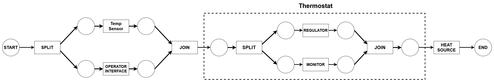
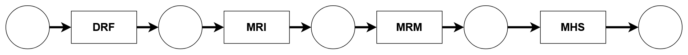
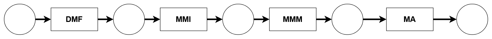
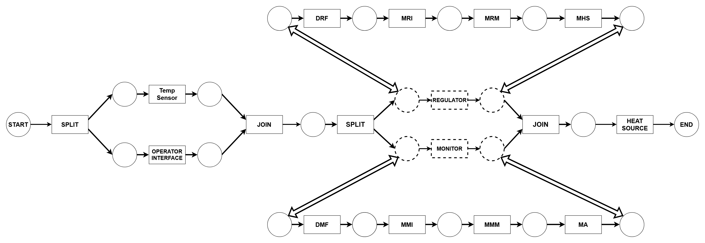
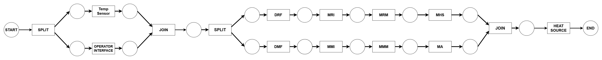

# Isolette System-level Contract Implemnatation Mockup

This file provides a mockup of the textual representation of a system-level contract for the Isolette system along with the expected verification conditions and a mockup of a runtime monitor for the system-level specifications. The work presented in this file is based on the [HAMRMicro05](https://github.com/santoslab/hamr-system-reasoning-prototype/tree/main/IsabelleFormalization/HAMRMicro05) formalization of the system-level reasoning framework which is outlined in detail in [System Verification for AADL-based Systems](https://hdl.handle.net/2097/47264).

## Scheduling Contraints

In order to use the system-level reasoning framework it is important to first establish the scheduling contraints for a static cyclic schedule of the system and then translate that into a Workflow net representation of the contraints (A usable and programatic representation of the contraints).

For example we may propose the following scheduling contraints.

### For the System
The components of the System must run in the following order

- The **Operator Interface** must be scheduled before the **Regulator**
- The **Operator Interface** must be scheduled before the **Monitor**
- The **Temp Sensor** must be scheduled before the **Regulator**
- The **Temp Sensor** must be scheduled before the **Monitor**
- The **Regulator** must be scheduled before the **Heat Source**
- The **Monitor** must be scheduled before the **Heat Source**

These contraints can be represented as the following Workflow net



**<u>NOTE:</u>** The split and join express that all components on one path from the split to the join have no scheduling contraints with respect to any component on any other path. This means that the components on one path can be interleaved with the components on another (e.g., Regualtor and Monitor can be interleaved in the schedule).

This expresses that the possible schedules for the Isolette are 
```
1. OI -> TS -> REG -> MON -> HS
2. OI -> TS -> MON -> REG -> HS
3. TS -> OI -> REG -> MON -> HS
4. TS -> OI -> MON -> REG -> HS
```


### For the Regualtor

The components of the Regulator must run in the following order
1. Detect Regulator Failure (DRF)
2. Manage Regulator Interface (MRI)
3. Manage Regulator Mode (MRM)
4. Manage Heat Source (MHS)

These contraints can be represented as the following Workflow net



This expresses the only schedule for the Regulator is 
```
DRF -> MRI ->  MRM -> MHS
```

### For the Monitor

The components of the Monitor must run in the following order
1. Detect Monitor Failure (DMF)
2. Manage Monitor Interface (MMI)
3. Manage Monitor Mode (MMM)
4. Manage Alarm (MA)

These contraints can be represented as the following Workflow net



This expresses the only schedule for the Monitor is 
```
DMF -> MMI ->  MMM -> MA
```

### Total Workflow Net Representation

Due to several properties, the Workflow nets for the Monitor and Regualtor can be composed with the Workflow net for the System. This new Worflow net represents the scheduling contraints for the system where the Monitor and Regulator are replaced with the components of the subsystems and their respective contraints.



This can be also be represented more cleanly as



This expresses that the possible schedules for the Isolette are 
```
1. OI -> TS -> SOME INTERLEAVING OF THE REG AND MON COMPONENTS -> HS
2. TS -> OI -> SOME INTERLEAVING OF THE REG AND MON COMPONENTS -> HS
```


It is important to not this new representation of the contraints preserves all aforementioned contraints but as one representation instead of three. This fact is important as, given some contraints are satisfied, each of the three orginial representations of the scheduling contraints can be used to specify certain aspects of the system and subsystems at different points in execution and then composed to represent the reasoning about the entire system. This means reasoning for the Isolette can be done on several layers

1. Reasoning about the execution of the subsystems in terms of its components (i.e, Regulator and Monitor)
2. Reasoning about the system in terms of the description of its subsystems

This means we can reason about the execution of the Regulator and Monitor seperately from the entire system, and then, composed into the reasoning about the enitre system by replacing the Regulator and Monitor with their respective contracts, components, and contraints.

Another benefit of this representation is that, given certain syntatic independence contraints are satisfied, the reasoning about the subsystems still holds when the components of two or more subsystems are interleaved within a schedule. This further enforces that reasoning about subsystems can be kept seperate from the rest of the system.

## System-level Reasoning

### System-level Contracts

### Verification Conditions

The verification conditions for a system contract are the minimal set of requirements neccesary to verify a system satisfies its contracts. These conditions will be automatically discharged via SMT-based tools in the final system.

This section will provide a high-level explanation of all the VCs along with a full example for each. The full list of VCs can be found [here](https://github.com/santoslab/hamr-system-reasoning-prototype/blob/main/IsoletteExample/Aritfacts/VCs.md).

#### Init-State VC

**<u>Definition:</u>** The initial state of the system satisfies the assertion that can be made at the start of a schedule cycle​.

**<u>Purpose:</u>** This VC verifies that initial state satisfies the requirements of the system before the system begins execution.


**<u>Example:</u>** The Init-State VC for the Isolette system is

```
st satisfies all initialize guarantees
⊢ START_Assert st
```

When expanded this VC becomes

```
// OI
I_Guar_lower_alarm_tempWstatus(lower_alarm_tempWstatus)
^ I_Guar_upper_alarm_tempWstatus(upper_alarm_tempWstatus)

// MRI
^ initialize_RegulatorStatusIsInitiallyInit(regulator_status)

// MRM
^ initialize_REQ_MRM_1(api_regulator_mode)

// MHS
^ initialize_initlastCmd(lastCmd) &&
^ initialize_REQ_MHS_1(heat_control)

// MMI
^ initialize_monitorStatusInitiallyInit(monitor_status)

// MMM
^ initialize_REQ_MMM_1(monitor_mode)

// MA
^ initialize_REQ_MA_1(lastCmd, alarm_control)

⊢ True
```


#### Pre-Assert VC

**<u>Definition:</u>** Given a pre-state st1 and a post-state st2, where st1 satisfies the pre-assertions of the transition, st2 should satisfy all post-assertions​.

* If the transition is tied to a component, then st1 and st2 need to satisfy the component contract and write frames​

* Else, the transition does not update the state so auxiliary preconditions are not needed (i.e. st1 = st2)​

**<u>Purpose:</u>** This VC is used to verify that executing a transition on a pre-assertion conformant pre-state produces a post-assertion conformant post-state 

**<u>Example:</u>** The Pre-Assert VC for the MHS component is

```
Post_MRM_Assert st
⊢ MHS's Precondition
```

When expanded this VC becomes

```
// Pre-assertions of MHS
sysProp_REQ_MRI_7(lower_desired_tempWstatus,  upper_desired_tempWstatus, interface_failure)
^ sysProp_REQ_MRI_8(lower_desired_tempWstatus, upper_desired_tempWstatus, lower_desired_temp, upper_desired_temp, interface_failure)
^ sysProp_lower_is_lower_temp(lower_desired_temp, upper_desired_temp)
⊢ compute_spec_lower_is_lower_temp_assume(lower_desired_temp, upper_desired_temp)
```

#### Next-Assert VC

```
Post_MRM_Assert st1
^ MHS_LocalWriteFrame st1 st2
^ MHS_GlobalWriteFrame st1 st2
^ MHS's Postcondition
⊢ END_Regulator_Assert st2
```

When expanded this VC becomes

```
// Pre-assertions of MHS (Post_MRM_Assert)
sysProp_REQ_MRI_7(old(lower_desired_tempWstatus), old(upper_desired_tempWstatus), old(interface_failure))
^ sysProp_REQ_MRI_8(old(lower_desired_tempWstatus), old(upper_desired_tempWstatus), old(lower_desired_temp), old(upper_desired_temp), old(interface_failure))
^ sysProp_lower_is_lower_temp(old(lower_desired_temp), old(upper_desired_temp))

// Local Write Frame
^ MHS_LocalWriteFrame st1 st2 (* Not ceccesary to expand *)

// Global Write Frame
^ old(lower_desired_tempWstatus) == lower_desired_tempWstatus
^ old(upper_desired_tempWstatus) == upper_desired_tempWstatus
^ old(lower_desired_temp) == lower_desired_temp
^ old(upper_desired_temp) == upper_desired_temp
^ old(interface_failure) == interface_failure
^ old(regulator_mode) == regulator_mode
^ ... (* Truncated global write frame for brevity *)

// Component Post-coniditon (Compute Guarantee)
^ compute_spec_lastCmd_guarantee(lastCmd, heat_control)

// Component Post-condition (Compute Cases)
^ compute_case_REQ_MHS_1(old(regulator_mode), heat_control);
^ compute_case_REQ_MHS_2(old(current_tempWstatus), old(lower_desired_temp), old(regulator_mode), heat_control);
^ compute_case_REQ_MHS_3(old(current_tempWstatus), old(regulator_mode), old(upper_desired_temp), heat_control);
^ compute_case_REQ_MHS_4(old(lastCmd), old(current_tempWstatus), old(lower_desired_temp), old(regulator_mode), old(upper_desired_temp), heat_control);
^ compute_case_REQ_MHS_5(old(regulator_mode), heat_control);
⊢ sysProp_NormalModeHeatOnn(regulator_mode, currentTempWStatus, lowerDesiredTempWStatus, upperDesiredTempWStatus, internalFailure, heat_control)  
```

#### Post-Pre VC


```
END_Assert
⊢ START_Assert
```

When exapnded the VC becomes

```
True
⊢ True
```

## Runtime Monitor

### How to Run with Docker Container

```
docker run -it --rm -v /PATH/TO/hamr-system-reasoning-prototype/IsoletteExample/855-s26-isolette-project/isolette:/home/microkit/isolette/ 
jasonbelt/microkit_provers bash -ci \
"cd isolette/hamr/microkit && \
MICROKIT_SDK=/home/microkit/provers/microkit-sdk-2.1.0 && \
make clean && \
CONFIG=monitor.mk make qemu"
```